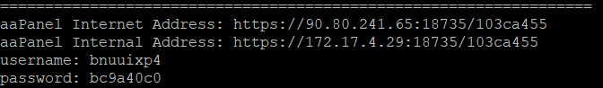
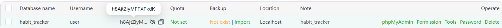
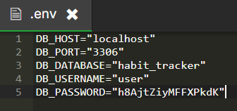
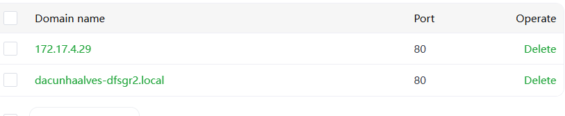

# Procédure de Déploiement

Décrivez ci-dessous votre procédure de déploiement en détaillant chacune des étapes. De la préparation du VPS à la méthodologie de déploiement continu.

## Préparation du VPS
```
#VM(a la racine): 
cd /var
mkdir depot-git
cd depot-git
git init --bare
git branch -m main


#en LOCAL:
git remote add vps root@172.17.4.29:/var/depot-git
git push vps

#VM: 
git --work-tree=/www/wwwroot/dacunhaalves-dfsgr2.local --git-dir=/var/depot-git checkout -f main
```
## Méthode de déploiement

installation de aapanel sur la VM via :

URL=https://www.aapanel.com/script/install_7.0_en.sh && if [ -f /usr/bin/curl ];then curl -ksSO "$URL" ;else wget --no-check-certificate -O install_7.0_en.sh "$URL";fi;bash install_7.0_en.sh aapanel



ce connecter via l'adresse internal, en utilisant le username et password fourni par la commande

une fois dessus choisir LMNP

allez dans website et ajouter le site, en entrant les infos requise

a ce moment la on peut commencer a faire le VPS (commande mis au dessus)

une fois ceci fait on peut choisir le dossier de lancement du site
ainsi que lancer un composer pour les packages

on ajoute ensuite la db dans l'onglet databases, j'ai du choisir comme username user et non root pour que la db se créer
on ajoute ensuite le .env a l'endroit ou il faut en le remplisant avec les bonnes info de la db créé avant




une fois ceci fait j'ai exporté les donnes et les tables de la base créer en local via 'php bin/create-database'
et importé dans celle créé sur aaPanel

pour avoir acces au site via le domaine
