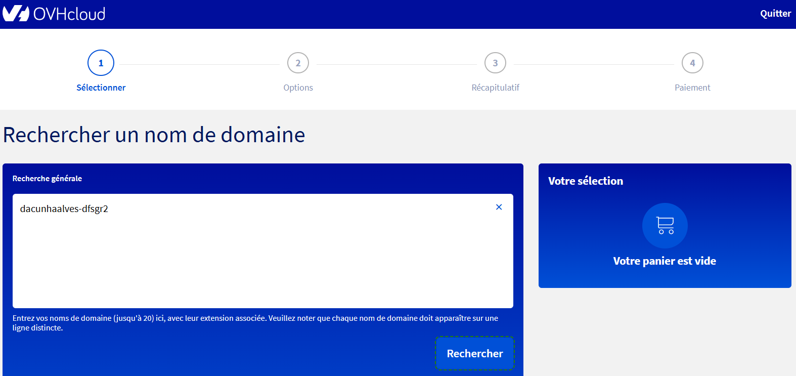
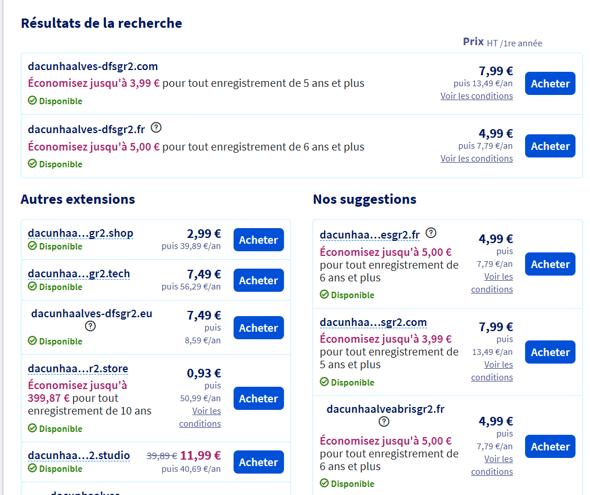
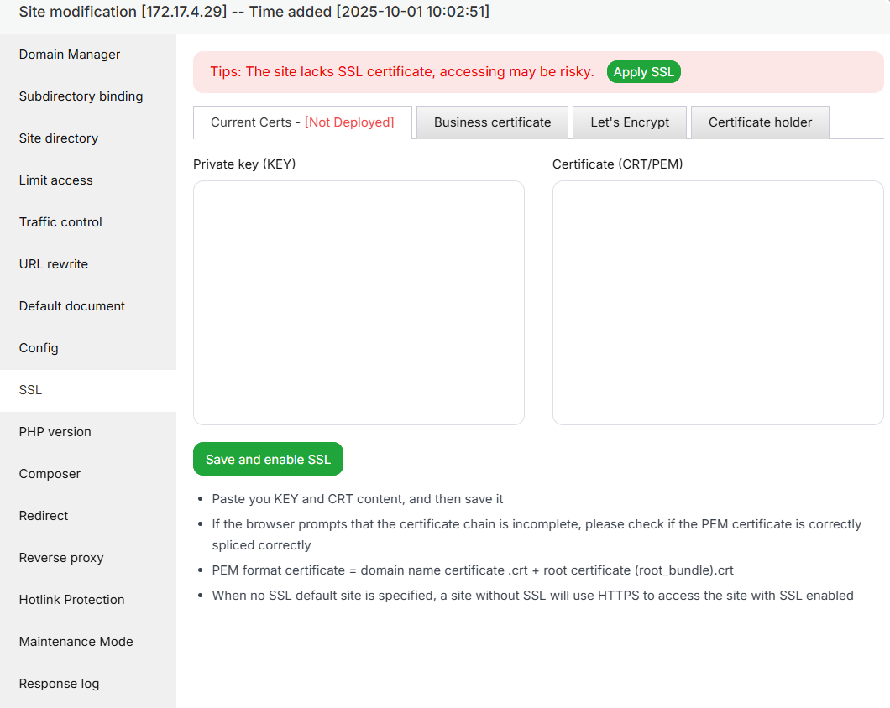

# Questions

Répondez ici aux questions théoriques en détaillant un maxium vos réponses :

1) Expliquer la procédure pour réserver un nom de domaine chez OVH avec des captures d'écran (arrêtez-vous au paiement) :

On va sur le site d'OVH est on vérifie la disponibilité du nom de domaine que l'on souhaite utiliser
On obtient donc une liste si le nom de domaine le permet avec la possibilité de choisir l'extension que l'on veut a des tarifs différents, et on peut procéder au payement

2. Comment faire pour qu'un nom de domaine pointe vers une adresse IP spécifique ?

Il faut se rendre sur l'interface de l'hébergeur, dans la gestion des paramètres des noms de domaine. Éditez un enregistrement pour votre nom de domaine avec et sans www, et faites-les pointer vers l'IP de votre serveur.

3. Comment mettre en place un certificat SSL ?

Par exemple, sur aaPanel, une fois la certification en possession, on a une private key en plus du certificat qu'on peut mettre dans l'onglet associé à SSL et l'activer, mais cela va dépendre de comment est hébergé le site

