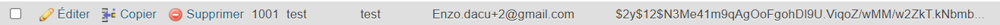

# TODO

Suite à un audit effectué en amont, voici les failles et les bugs qui ont été identifés comme prioritaire.

## FAILLES

* Des utilsateurs non admin ont des accès à l'interface de gestion des utilisateurs 
```
manques des guards sur les routes pour gérer les acces au rôles
```
* Les mots de passes ne sont pas chiffrée en base de données...
```
# ajout dans register et login d'un hash de mot de passes avant l'envoie en db et une verification lors de la connection

$user['password']= password_hash($user['password'],PASSWORD_DEFAULT);

password_verify($password, $user->getPassword())

```

* Des injections de type XSS ont été détéctées sur certains formulaires

* On nous a signalé des injections SQL lors de la création d'une nouvelles habitudes
  * exemple dans le champs "name" : foo', 'INJECTED-DESC', NOW()); --


## BUGS

* Une 404 est détéctée lors de l'accès à l'URL ``/habit/toggle``

```
fix: ajouter la routes dans routes.json 
    {
        "path": "/habit/toggle",
        "controller": "App\\Controller\\Member\\HabitsController",
        "action": "toggle"
    },
```

* Fatal error: Uncaught Error: Class "App\Controller\Api\HabitsController" lorsque l'on accède à l'URL  ``/api/habits``

## **ATTENTION : certains bugs n'ont pas été listé**
```
bug lors de la création d'un user identiques


changement de DB_USERNAME="root"par user car probleme de conflit de nom avec root sur aapanel


il n'y avait pas de page de gestion des habitudes pour les admins

bug lors de la redirection de page apres la création d'un compte changer le chemin vers le dashboard du user plutot que ticket

```